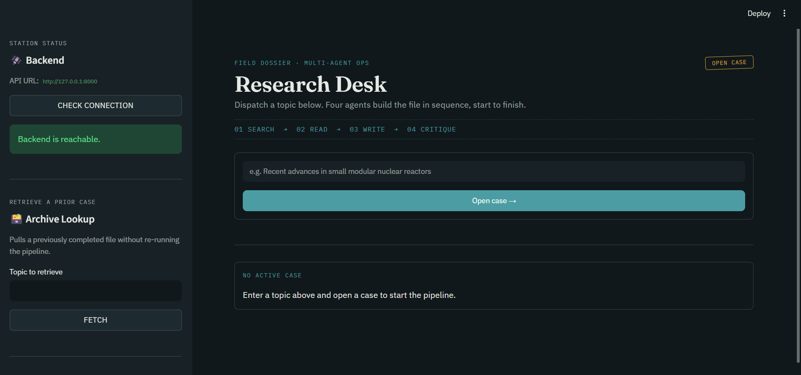
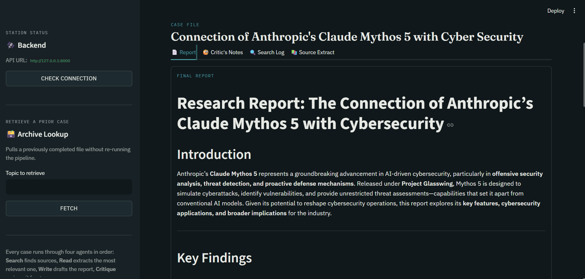
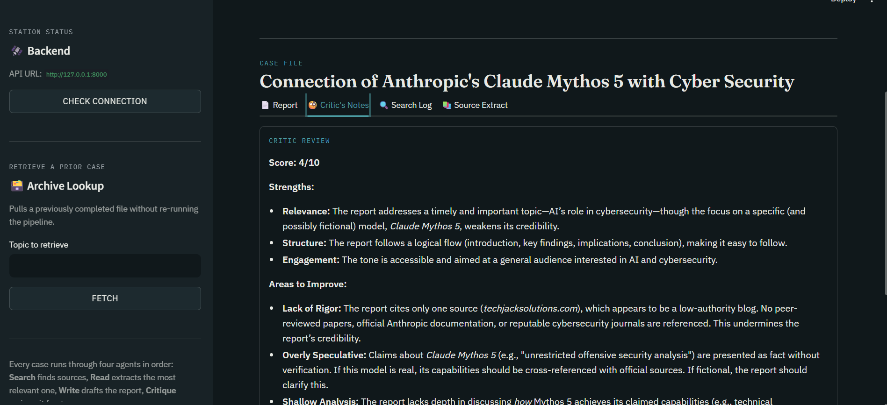

# 🔍 Multi-Agent Research Assistant

---

## 🧠 Project Overview

**Multi-Agent Research Assistant** is an AI-powered research automation system that performs end-to-end web research using a multi-agent architecture.

The system accepts a research topic from the user, searches the web for relevant sources, extracts content from multiple websites, generates a structured research report, and finally critiques the generated report to improve quality and reliability.

The application combines **Agentic AI**, **LangChain LCEL Pipelines**, **Mistral AI**, **FastAPI**, and **Streamlit** to create an automated research workflow.

Website : https://airesearchsys.streamlit.app/
---

<p align="center">
  
</p>

---

<p align="center">
  
</p>

---

<p align="center">
  
</p>

---

## 🚀 Problem Statement

Conducting research manually often involves:

- Searching multiple sources
- Reading numerous articles
- Extracting relevant information
- Writing summaries
- Verifying report quality

This project automates the entire workflow using multiple AI agents that collaborate to produce a high-quality research report.

---

## 🤖 Multi-Agent Workflow

The system follows a four-stage workflow:

```text
User Research Query
          │
          ▼
 ┌─────────────────┐
 │ Search Agent    │
 │ (Tavily Search) │
 └─────────────────┘
          │
          ▼
 ┌─────────────────┐
 │ Scraping Agent  │
 │ (BeautifulSoup) │
 └─────────────────┘
          │
          ▼
 ┌─────────────────┐
 │ Report Generator│
 │ (LCEL Chain)    │
 └─────────────────┘
          │
          ▼
 ┌─────────────────┐
 │ Critique Agent  │
 │ (LCEL Chain)    │
 └─────────────────┘
          │
          ▼
   Final Research Report
```

---

<p align="center">
  
</p>

---

## ⚙️ Architecture

```text
                    ┌────────────────────┐
                    │    User Query      │
                    └─────────┬──────────┘
                              │
                              ▼
                   ┌─────────────────────┐
                   │    FastAPI Server   │
                   └─────────┬───────────┘
                             │
                             ▼
              ┌──────────────────────────────┐
              │       Search Agent           │
              │  Tavily Search Tool          │
              └──────────────┬───────────────┘
                             │
                             ▼
              ┌──────────────────────────────┐
              │      Scraping Agent          │
              │ BeautifulSoup Tool          │
              └──────────────┬───────────────┘
                             │
                             ▼
              ┌──────────────────────────────┐
              │   Report Generation Chain    │
              │      LCEL Pipeline           │
              └──────────────┬───────────────┘
                             │
                             ▼
              ┌──────────────────────────────┐
              │      Critique Chain          │
              │      LCEL Pipeline           │
              └──────────────┬───────────────┘
                             │
                             ▼
                    Final Research Report
```

---

## 🧩 Agents

### 1️⃣ Search Agent

Responsible for:

- Understanding the research topic
- Searching relevant web sources
- Selecting useful URLs
- Gathering contextual information

**Tool Used:**

- Tavily Search API

---

### 2️⃣ Scraping Agent

Responsible for:

- Visiting retrieved URLs
- Extracting article content
- Cleaning unnecessary HTML
- Providing structured text to downstream components

**Tool Used:**

- BeautifulSoup

---

## 🔗 LCEL Pipelines

Instead of traditional chains, the project uses **LangChain Expression Language (LCEL)** pipelines.

### Report Generation Pipeline

Responsibilities:

- Organize collected information
- Generate structured reports
- Create coherent summaries
- Present findings professionally

---

### Critique Pipeline

Responsibilities:

- Review generated report
- Identify missing details
- Detect weak arguments
- Improve overall report quality

---

## 🛠 Features

- Multi-Agent Architecture
- Tavily-powered Web Search
- Website Scraping with BeautifulSoup
- Automated Research Workflow
- Structured Report Generation
- AI-based Report Critiquing
- FastAPI Backend
- Streamlit Frontend
- Cloud Deployment
- Configurable Parameters via YAML

---

## 🌐 Tech Stack

| Component | Technology |
|------------|------------|
| LLM | Mistral Small Latest |
| Agent Framework | LangChain |
| Workflow | LCEL Pipelines |
| Search Tool | Tavily |
| Web Scraping | BeautifulSoup |
| Backend | FastAPI |
| Frontend | Streamlit |
| Deployment | Render |
| Deployment | Streamlit Cloud |
| Configuration | YAML |
| Environment Management | Python Dotenv |

---


## 📁 Project Structure

```text
Multi-Agent-Research-Assistant
│
├── src
│   │
│   ├── client
│   │   ├── .streamlit
│   │   │   └── config.toml
│   │   │
│   │   ├── app.py
│   │   └── config.py
│   │
│   └── server
│       │
│       ├── components
│       │   ├── agents.py
│       │   └── tools.py
│       │
│       ├── logger
│       │   └── __init__.py
│       │
│       ├── utils
│       │   ├── common.py
│       │   └── __init__.py
│       │
│       ├── config.py
│       ├── params.yaml
│       ├── pipeline.py
│       ├── main.py
│       └── requirements.txt
│
├── .gitignore
├── LICENSE
├── README.md
└── template.py
```

---

## 🔧 Environment Variables

Create a `.env` file inside the server directory.

```env
MISTRAL_API_KEY=your_mistral_api_key

TAVILY_API_KEY=your_tavily_api_key
```

---

## ⚡ Quick Setup

### Clone Repository

```bash
git clone https://github.com/your-username/Multi-Agent-Research-Assistant.git

cd Multi-Agent-Research-Assistant
```

---

### Create Virtual Environment

```bash
uv venv

# Windows
.venv\Scripts\activate

# Linux / Mac
source .venv/bin/activate
```

---

### Install Backend Dependencies

```bash
cd src/server

uv pip install -r requirements.txt
```

---

### Run FastAPI Backend

```bash
uvicorn main:app --reload --port 8000
```

Backend will run at:

```text
http://localhost:8000
```

Swagger Documentation:

```text
http://localhost:8000/docs
```

---

### Run Streamlit Frontend

```bash
cd src/client

streamlit run app.py
```

Frontend will run at:

```text
http://localhost:8501
```

---

## 📡 API Endpoint

### Generate Research Report

```http
POST /research
```

Request Body:

```json
{
  "query": "Future of Artificial Intelligence in Healthcare"
}
```

Response:

```json
{
  "report": "Generated research report...",
  "critique": "Review and improvements..."
}
```

---

## ⚙️ Configuration

Project parameters can be modified from:

```text
src/server/params.yaml
```

Example:

```yaml
llm:
  temperature: 0.7

search:
  max_results: 5

scraping:
  max_pages: 10
```

This allows experimentation without modifying source code.

---

## ☁️ Deployment

### Backend Deployment

Hosted on **Render**

Start Command:

```bash
uvicorn main:app --host 0.0.0.0 --port 10000
```

---

### Frontend Deployment

Hosted on **Streamlit Cloud**

Start Command:

```bash
streamlit run app.py
```

---

## 📚 Learning Outcomes

This project demonstrates:

- Agentic AI Systems
- Multi-Agent Collaboration
- Tool Calling
- ReAct Agents
- Web Search Integration
- Web Scraping Pipelines
- LangChain LCEL
- FastAPI Development
- Streamlit Applications
- Cloud Deployment

---

## 👨‍💻 Author

**Pratik Patil**

---

## 📄 License

This project is licensed under the MIT License.

---

## ⭐ If you found this project useful

Consider giving the repository a **star ⭐** to support the project and future improvements.
